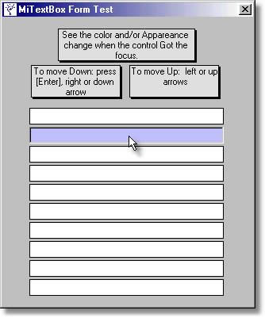



## MiTextBox

### Description

You can set the Text Alignment (Left, Right, Center)

You can set the control Appearance (Flat, 3D) and Color in Normal and OnFocus states.

You can set the type of entry allowed (Numbers, Numbers w/ simbols, Characters, (Y) or (N), Alphanumeric or Anything)

You can set to play beep on bad entries.

You can set Auto Upper Case.

You can set Auto Select Text.

Undo Text with Escape key pressing.

Controls navigation with keys:

Next TextBox: right arrow, down arrow and Enter.

Previous TextBox: left arrow, up arrow.

Support all the VB TextBox methods and properties
 
### More Info
 

             |
---                |---
**Submitted On**   |2003-08-05 22:51:12
**By**             |[José Luis Farías](https://github.com/Planet-Source-Code/PSCIndex/blob/master/ByAuthor/jos-luis-far-as.md)
**Level**          |Intermediate
**User Rating**    |5.0 (15 globes from 3 users)
**Compatibility**  |VB 6\.0
**Category**       |[Custom Controls/ Forms/  Menus](https://github.com/Planet-Source-Code/PSCIndex/blob/master/ByCategory/custom-controls-forms-menus__1-4.md)
**World**          |[Visual Basic](https://github.com/Planet-Source-Code/PSCIndex/blob/master/ByWorld/visual-basic.md)
**Archive File**   |[MiTextBox162471862003\.zip](https://github.com/Planet-Source-Code/jos-luis-far-as-mitextbox__1-47442/archive/master.zip)

